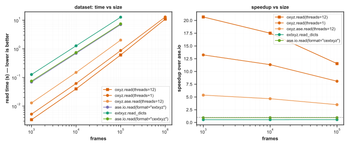
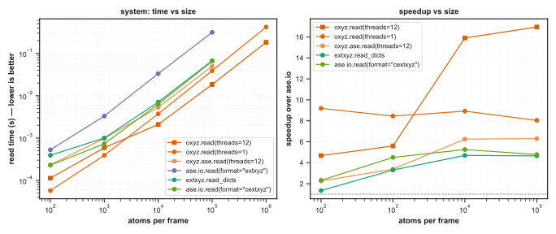
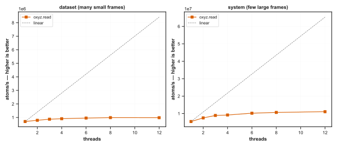

# oxyz

[](https://github.com/theochemtheo/oxyz/actions/workflows/test.yml)
[](https://pypi.org/project/oxyz/)
[](https://www.python.org/downloads/)
[](https://scientific-python.org/specs/spec-0000/)

Fast, schema-aware [extxyz](https://github.com/libAtoms/extxyz) reading for
atomistic machine learning. A Rust parser behind a small, typed Python API:
numpy arrays out, `ase.Atoms` on request, and a one-pass schema report that
tells you whether a training file is what you think it is.

```python
import oxyz

frames = oxyz.read("train.extxyz")          # all cores, one pass
frames[0].columns["pos"]                    # float64 ndarray, shape (n_atoms, 3)
frames[0].metadata["energy"]                # float

schema = oxyz.infer_schema("train.extxyz")
schema.is_consistent                        # False: now you know before training
print(schema)                               # which keys drift, and in how many frames
```

`oxyz` exists for the gap between "extxyz is the lingua franca of atomistic
ML datasets" and "every Python extxyz reader is slow enough to matter".
Reading a dataset into numpy is 16–25× faster than `ase.io.read` on the
benchmarks below; reading it into `ase.Atoms` objects is 2.6–6.6× faster.
The same single pass can also tell you the dataset's schema: which columns
and metadata keys appear, with what types and shapes, and how consistently.
That is the part of dataset ingestion that usually goes unchecked.

## Quickstart

```sh
pip install oxyz            # minimal deps; add extras as needed, e.g. oxyz[ase]
```

oxyz follows [Semantic Versioning](https://semver.org): within a major version
no release removes or incompatibly changes a public name (the names exported
from `oxyz` and its documented submodules, and the `oxyz` command-line verbs
and options), though new ones may be added.

Runnable, self-contained versions of each use below live in
[`examples/`](examples/).

### Install

```sh
pip install oxyz                # minimal dependencies
pip install "oxyz[ase]"         # adds ase.Atoms conversion
pip install "oxyz[metatomic]"   # adds metatomic.torch.System reading
pip install "oxyz[torch-sim]"   # adds torch_sim.SimState reading
pip install "oxyz[s3]"          # adds reading from S3-compatible URLs
```

Runtime dependencies are kept to a minimum; the extras above are pulled in
lazily, only when their target is used.

Wheels cover CPython ≥3.12 on Linux (x86_64, aarch64), macOS (arm64,
x86_64), and Windows (x64).

oxyz follows [SPEC 0](https://scientific-python.org/specs/spec-0000/) for its
support window: Python versions are dropped three years after release, so the
current minimum is 3.12.

Installing puts an `oxyz` command on the path; `oxyz scan train.extxyz`
summarises a file without writing any Python. It also runs without
installing, via `uvx oxyz scan train.extxyz`.

## What you get beyond ASE

**Array-native frames.** A `Frame` is a frozen dataclass holding the file's
columns as numpy arrays and its comment-line metadata as typed Python
values, with no per-atom Python objects or calculator indirection. Names and
values are kept exactly as written: `force` and `forces` stay distinct,
nothing is reordered, and `Lattice` remains the flat 9-value array from the
file. Normalisation is the ASE layer's job (or yours).

**Batches in the PyG layout.** `Batch` concatenates frames atom-major,
CSR-style: every per-atom column is one dense array of `total_atoms` rows,
frame `i` occupying rows `offsets[i]:offsets[i+1]`; per-frame metadata
stacks into arrays of `n_frames` rows. `batch.ptr` and `batch.batch` carry
their PyTorch Geometric names, and `torch.from_numpy(batch.columns["pos"])`
is zero-copy, so the path into a training loop is short.

```python
for batch in oxyz.iread_batch("bulk.extxyz", atoms_per_batch=4096,
                               shuffle=True, seed=0):
    batch.columns["forces"]        # (total_atoms, 3)
    batch.metadata["energy"]       # (n_frames,)
    batch.frame_indices            # which file frames these are
```

`iread_batch` packs by frame count or by a total-atom budget, in file
order or seeded-shuffled. Batch composition depends only on the file, the
knobs, and the seed, never on `threads`.

**Schema inference.** `infer_schema` folds the whole file into a `Schema`:
per-column and per-metadata-key observed variants (kind, width or shape,
and how many frames used each), presence counts, a strict `is_consistent`,
and per-entry `unified`, the single type an Int/Real drift can be
promoted to, or `None` when the conflict is genuine. The classic failure
it catches: a generator script that writes isolated-atom frames with
integer forces and no `Lattice` into an otherwise uniform bulk dataset.
The same pass keeps the per-frame atom counts, so a `Schema` also reports
the atom-count distribution (`mean_atoms`, `median_atoms`, `std_atoms`,
alongside the min/max above) without a second read of the file.

```text
>>> print(oxyz.infer_schema("train.extxyz"))
1000 frames, 63841 atoms (min 1, max 96)

per-atom columns:
  species: S:1 (1000/1000 frames)
  pos: R:3 (1000/1000 frames)
  forces: I:3 (5/1000 frames), R:3 (995/1000 frames) (unifies to R:3)

metadata:
  energy: Real (1000/1000 frames)
  Lattice: RealArray[9] (995/1000 frames)
```

**Structural scanning.** `oxyz.scan` reads only the frame skeleton (byte
offsets and declared atom counts) without parsing any contents. It is the
cheap first question to ask of an unfamiliar file (5 ms for a 22 MiB file
below) and the machinery behind random access, shuffled batching, and
lazy negative indexing. The same statistics, alongside the inferred
schema, are a terminal away with `oxyz scan` (see [Command line](#command-line)).

**Parallelism is a knob.** Readers take `threads`: `None`
parses on every core, `1` is the exact serial streaming path. Results and
errors are identical either way; parity tests hold the parallel path to
the serial path's behaviour.

## In place of ASE

`oxyz.ase.read` and `oxyz.ase.iread` are drop-ins for `ase.io.read` /
`ase.io.iread` on extxyz files, taking the same index grammar as
`oxyz.read` (see [API](#api)):

```python
import oxyz.ase

atoms = oxyz.ase.read("train.extxyz")             # last frame, like ase.io.read
images = oxyz.ase.read("train.extxyz", ":")       # every frame
for atoms in oxyz.ase.iread("train.extxyz", "::10"):
    ...
```

The conversion reuses `ase.io.extxyz`'s own routing tables and
`set_calc_and_arrays`, so key handling (which results go to the
calculator, which to `arrays`) agrees with ASE by construction; golden
tests hold the two readers equal on the test corpus apart from the
divergences below. Reads are lazy:
`read(path, 3)` parses four frames and stops, and negative or reverse
selections resolve through a structural scan and seek rather than a full
parse: `read(path)` on a long trajectory does not parse the whole file
to return the last frame.

## Divergences from ASE

`oxyz.ase.read` matches `ase.io.read` field for field on the test corpus
except for the cases below: two deliberate, two that follow from
honouring the extxyz grammar and oxyz's typed model where ASE's parser
does not. These four are settled design choices under the 1.0 contract:
each is the behaviour oxyz intends to keep.

**Deliberate**, an error or an acceptance, never a silently different
value:

- **Voigt stress:** 6-component `stress` is accepted and routed to the
  calculator; ASE's comment parser rejects the file.
- **Non-symbol species:** a species that is not a chemical symbol raises
  an error; ASE builds a nonsense `Atoms`.

**Grammar and typing**, a different value, no error:

- **New-style string arrays:** `tags=["a","b"]` is typed as `list[str]`;
  ASE keeps the one raw string `'"a","b"'`.
- **Single-quoted values:** the grammar makes `"` the only quote
  character, so `label='hello'` keeps its quotes and `note=it's` keeps its
  apostrophe; ASE strips the single quotes (and reads `it's` as `its`).

## Reading against a schema

Assert what a file should contain and have it checked as you read:

```python
import oxyz

frames = oxyz.read("train.extxyz", schema="schema.yaml")   # conformance="required"
```

A schema names expected columns, metadata, and structural facts, using the
extxyz kind letters (`R`/`I`/`L`/`S`):

```yaml
columns:
  species: {kind: S}
  pos: {kind: R, width: 3}
  "descriptor_*": {kind: R, count: 5}
metadata:
  energy: {kind: R}
```

`conformance` is `"strict"` (missing, extra, or mismatched entries all raise),
`"required"` (the default: required entries enforced, extras allowed), or
`"warn"` (deviations become silenceable warnings). `oxyz check file.extxyz
--schema schema.yaml` reports every violation at once; `oxyz scan --emit-schema
schema.yaml file.extxyz` writes a starting schema from a file you trust.

### Projecting to a fixed shape

A schema validates by default. Add `mode: project` (or pass `mode="project"` at
the call site) and it instead *reshapes* each frame to exactly the fields it
declares: undeclared columns and metadata dropped, absent optionals filled.
That makes a mixed-schema file, where an optional property is present only in
some frames, readable as one batch:

```python
frames = oxyz.read("mixed.extxyz", schema=spec)        # spec.mode == "project"
batch = oxyz.read_batch("mixed.extxyz", schema=spec)   # now batchable
```

Projection works across the frame readers, the batch readers, and the
`oxyz.ase`/`oxyz.metatomic`/`oxyz.torch_sim` targets, all through the same
`schema=`/`mode=`/`conformance=` arguments. An absent REAL column fills `NaN`;
INT, BOOL, and STR have no natural null, so an optional one needs an explicit
`fill` value. Pattern rules (`descriptor_*`) cannot describe a fixed shape, so
`SchemaSpec.freeze(sample)` expands them against a representative file into
literal rules: required where a column appears in every frame, optional where
it appears in only some. `oxyz freeze` and `oxyz scan --emit-schema --project`
write a frozen, project-ready schema. Validate mode is unchanged.

## PyTorch targets

Two more converters land extxyz directly into a training-adjacent PyTorch
type, skipping the ASE round trip; each needs its own extra.

### metatomic

`oxyz.metatomic.read` and `iread` read extxyz straight into
`metatomic.torch.System`s, reproducing
`metatomic.torch.systems_to_torch(ase.io.read(...))` without the ASE
round-trip: species map to atomic numbers through oxyz's own element
table, and the cell follows the same Fortran-order `Lattice` reshape and
pbc-masked zeroing. Needs `pip install "oxyz[metatomic]"`.

```python
import torch
import oxyz.metatomic

systems = oxyz.metatomic.read("train.extxyz", dtype=torch.float64)   # list[System]
for system in oxyz.metatomic.iread("train.extxyz"):                  # streaming, bounded memory
    ...
```

`read`/`iread` take the same index grammar as `oxyz.read` (see
[API](#api)), plus `dtype`/`device`/`positions_requires_grad`/`cell_requires_grad`
matching `systems_to_torch` (`dtype=None` follows `torch.get_default_dtype()`).

For pipelines that also need targets, `SystemSource` parses a file once and
serves both the structures and array-native target extraction:

```python
source = oxyz.metatomic.SystemSource("train.extxyz")
systems = source.systems(dtype=torch.float64)
energy = source.per_config("energy", dtype=torch.float64)         # (n_frames, ...)
forces, offsets = source.per_atom("forces", dtype=torch.float64)  # (total_atoms, 3) + offsets
```

These are the pieces a downstream reader would build on, for example a
metatrain `readers/oxyz.py`, where `SystemSource.systems()` backs
`read_systems` and `per_config`/`per_atom` back the energy/forces/stress
readers, with the gradient-sign, volume, and `TensorMap` conventions
staying on the metatrain side. oxyz depends only on torch and
metatomic-torch, never on metatrain or metatensor; that integration is
left to metatrain deliberately.

### torch_sim

`oxyz.torch_sim` reads extxyz into `torch_sim.SimState`, reproducing
`torch_sim.io.atoms_to_state(ase.io.read(...))`, and takes the same index
grammar as `oxyz.read` (see [API](#api)). `SimState` is natively
batched (one state holds many systems with their atoms concatenated), so
the reader maps onto oxyz's batched parse rather than the per-frame path:
`read` returns a *single* batched state, `iread` streams the file as a
sequence of batched states. Needs `pip install "oxyz[torch-sim]"`.

```python
import torch
import oxyz.torch_sim

state = oxyz.torch_sim.read("train.extxyz")              # one batched SimState
substate = oxyz.torch_sim.read("train.extxyz", "0:64")   # a slice, still one state
```

With a model and a GPU, hand the whole-file state to `torch_sim`'s
`BinningAutoBatcher`, which sizes memory-aware batches by probing the model:

```python
from torch_sim.autobatching import BinningAutoBatcher

batcher = BinningAutoBatcher(model, memory_scales_with="n_atoms_x_density")
batcher.load_states(oxyz.torch_sim.read("train.extxyz"))
```

For files too large to materialise, `iread` streams batches itself, with the
same binning knobs as `oxyz.iread_batch` (`frames_per_batch` /
`atoms_per_batch` / `memory_scales_with` + `max_scaler`):

```python
for batch in oxyz.torch_sim.iread("huge.extxyz", memory_scales_with="n_atoms_x_density",
                                  max_scaler=50_000):
    ...
```

Cells follow `torch_sim`'s column-vector convention (ASE's cell transposed),
every system shares one pbc (frames that disagree are an error), and masses
come from a `masses` column or, failing that, the ASE-parity atomic-weight
table. `dtype=None` infers from the data (float64), matching `atoms_to_state`;
pass `torch.float32` for ML use. `SimStateSource` parses once and serves the
state plus array-native `per_config` / `per_atom` extraction.

## Command line

Installing oxyz provides an `oxyz` command for inspecting files from the
shell; `uvx oxyz` runs it without installing anything.

```sh
oxyz scan train.extxyz
```

`scan` prints per-frame atom-count statistics followed by the inferred
schema, rendered as pasteable schema syntax you can drop into a `.yaml` and
read back with `schema=`. Unlike the `oxyz.scan` primitive, which parses
nothing, the command reads the whole file to infer the schema; `--no-schema`
drops back to the cheap structural pass and reports only the statistics.
`--emit-schema PATH` writes the schema to a `.yaml`/`.json` file instead of
printing it, and `--json` emits a single `{"stats": ..., "schema": ...}`
object for piping into other tools.

```text
$ oxyz scan train.extxyz
frames:      3
atoms total: 6
atoms/frame: min 1  max 3  mean 2.00  median 2.00  std 0.82

# schema — paste into a .yaml and read with read(..., schema=...)
columns:
  species: {kind: S}
  pos: {kind: R, width: 3}
  forces: {kind: R, width: 3}
metadata:
  Lattice: {kind: R, shape: [9]}
  energy: {kind: R}
```

## Performance

Timings below are means over repeated rounds (each case gets a
one-second budget over at least five rounds) on an
Apple M3 Pro under CPython 3.13; the exception is the MAD-1.5 rows, timed
over a single round, which
[benchmarks/run.py](https://github.com/theochemtheo/oxyz/blob/main/benchmarks/run.py)
reproduces only where the dataset is present. Full tables with standard
deviations, the environment, and the fixture definitions are in
[benchmarks/RESULTS.md](https://github.com/theochemtheo/oxyz/blob/main/benchmarks/RESULTS.md).

Read time as the file scales, over two independent size axes and over
thread count. The dataset family is a corpus-shaped file of many small
frames (frame count swept); the system family is a few large frames
(atoms per frame swept):







Whole-file reads to numpy, against [cextxyz], the libAtoms C parser, via its
`read_dicts` interface. The last row is the full MAD-1.5
([doi:10.24435/materialscloud:ak-4p](https://doi.org/10.24435/materialscloud:ak-4p))
r²SCAN training set (303.5 MiB, 180,184 frames of real, chemically diverse
structures); the rest are generated fixtures:

| workload | `oxyz.read(threads=12)` | `oxyz.read(threads=1)` | `extxyz.read_dicts` |
| --- | ---: | ---: | ---: |
| 2,000 small frames | **9.43 ms** | 18.1 ms | 229 ms |
| 4 × 100,000 atoms | **23.5 ms** | 52.2 ms | 91.5 ms |
| 2,000 frames, heavy metadata | **14.1 ms** | 26.5 ms | 429 ms |
| MAD-1.5, 180,184 frames | **1.20 s** | 1.73 s | 23.4 s |

Whole-file reads to `ase.Atoms`, against the [ase-extxyz] plugin (the same C
parser behind ASE's IO) and ASE's own reader:

| workload | `oxyz.ase.read(threads=12)` | `oxyz.ase.read(threads=1)` | `ase.io.read(format="cextxyz")` | `ase.io.read(format="extxyz")` |
| --- | ---: | ---: | ---: | ---: |
| 2,000 small frames | **63.4 ms** | 76.6 ms | 122 ms | 217 ms |
| 4 × 100,000 atoms | **66.9 ms** | 96.5 ms | 92.0 ms | 441 ms |
| 2,000 frames, heavy metadata | **83.6 ms** | 96.0 ms | 309 ms | 358 ms |
| MAD-1.5, 180,184 frames | **7.50 s** | 8.80 s | 12.9 s | 19.6 s |

Beyond whole-file reads: on selective reads (every 20th frame of the
small-frames file) `oxyz.read_batch` takes 1.7 ms against 22 ms for ASE;
on peak memory, streaming `iread` through the small-frames file
grows RSS by 12 MiB where `ase.io.iread` grows it by 56 MiB
([benchmarks/MEMORY.md](https://github.com/theochemtheo/oxyz/blob/main/benchmarks/MEMORY.md)).
Reading the full MAD-1.5 set needs the dataset itself, so those rows are
reproducible only with the file in place; the recipe is in
[benchmarks/RESULTS.md](https://github.com/theochemtheo/oxyz/blob/main/benchmarks/RESULTS.md).
The one place a text parser is predictably slower is against binary stores
(LMDB, SQLite, mmap-backed formats); see
[benchmarks/RESULTS.md](https://github.com/theochemtheo/oxyz/blob/main/benchmarks/RESULTS.md)
for those comparisons.

[cextxyz]: https://github.com/libAtoms/extxyz
[ase-extxyz]: https://pypi.org/project/ase-extxyz/

## Writing

`oxyz.write` is the inverse of the readers: it takes a `Frame`, an `ase.Atoms`,
or an iterable mixing them, and writes extxyz, choosing the codec from the path
extension (overridable with `compression=`):

```python
oxyz.write("out.extxyz", frames)         # a Frame or list of Frames
oxyz.write("out.extxyz.gz", atoms)       # an ase.Atoms, gzipped by extension
oxyz.write("-", frames)                  # "-" writes to stdout

with oxyz.Writer("traj.extxyz") as w:    # incremental, streams one frame at a time
    for frame in produce():
        w.write(frame)
```

Reals are written shortest-round-trippable, so `read` then `write` reproduces
every `f64` bit for bit; the output is compact rather than column-aligned.
Columns are written `species`, `pos`, then the rest; the comment line is
`Lattice`, `pbc`, `Properties`, then the remaining metadata. A frame without
both a `species` and a `pos` column is rejected.

As with the readers, `threads` is a knob: `oxyz.write` serialises across cores
by default and the output bytes are identical at any thread count (only
serialisation parallelises; the output stream stays serial). `Writer` streams
frame-by-frame, so peak memory is bounded by the largest frame rather than the
file; `Writer(path, batch=n)` keeps the incremental form but
serialises `n` frames at a time in parallel, trading one batch of memory for
throughput.

The writable codecs are plain, `.gz`, `.zip`, `.tar`, and `.tar.gz`; `level`
(`0..=9`) tunes the deflate-based ones. `append=True` adds to an existing file
for the formats that allow a concatenated stream (plain, gzip) and is rejected
for the archive codecs and for stdout. Writing `.zst` is not yet supported.

## Compressed files

Any reader takes a compressed path and decodes it while streaming, so
`read("run.xyz.gz")` just works and stays parallel without
decompressing to a temporary file:

```python
oxyz.read("run.xyz.gz")                    # .gz, .tar.gz, .zip, .zst, .tar
oxyz.read("runs.zip", member="run2.xyz")   # pick one archive entry
oxyz.read("run.bin", compression="gzip")   # force a codec by hand
```

The codec is inferred from the extension (then the magic bytes), or set with
`compression=` (`"none"`/`"gzip"`/`"zstd"`/`"zip"`). An archive holding more
than one extxyz file needs `member=`; otherwise it errors and lists what it
holds. A compressed stream cannot be seeked, so two kinds of random access
are constrained: `iread_batch` with `shuffle`/`atoms_per_batch`/`memory_scales_with`,
and reverse or negative ASE indices. These either read the whole file into
memory (the ASE index path, as ASE itself does) or raise pointing at the
limitation; decompress the file first if you need them.

## Reading from object storage

`read`, `iread`, `scan`, `infer_schema`, the batch readers, and the output
targets (`oxyz.ase`, `oxyz.metatomic`, `oxyz.torch_sim` readers and their
`SystemSource`/`SimStateSource`) accept S3-compatible URLs when the `s3` extra
is installed (see [Install](#install)):

```python
frames = oxyz.read("s3://bucket/train.extxyz.gz")
```

Credentials and endpoint come from `AWS_*` environment variables by default;
pass `storage_options=` to point at a non-AWS store (MinIO, R2, Ceph):

```python
oxyz.read(
    "s3://bucket/train.extxyz",
    storage_options={"endpoint": "https://minio.example", "region": "us-east-1"},
)
```

`gs://` and `az://` are routed through the same obstore mechanism; they are
supported in principle but are not covered by oxyz's own integration tests, so
treat them as best-effort. Compression (`.gz`, `.zst`, `.tar.gz`,
`.zip`) and archive `member=` selection apply as for local files. As with
compressed local files, a remote stream cannot seek, so random-access batch
strategies (`shuffle`, `atoms_per_batch`, `memory_scales_with`) need a local
copy; see [Compressed files](#compressed-files).

## API

```python
oxyz.read(path, index=":", *, threads=None)  -> Frame | list[Frame]  # int index: one Frame
oxyz.iread(path, index=":")                   -> Iterator[Frame]   # streaming, bounded memory
oxyz.read_batch(path, index=":", *, threads=None) -> Batch    # ":" (default): whole file
oxyz.iread_batch(path, *, frames_per_batch=None, atoms_per_batch=None,
                  shuffle=False, seed=None, threads=None) -> Iterator[Batch]
oxyz.scan(path)                              -> FrameIndex
oxyz.infer_schema(path)                      -> Schema

# read/iread select with index: an int (one Frame), a slice or slice string like
# "1:10:2", or a sequence of non-negative ints (a list, in order). The default
# ":" reads every frame.
#
# Every reader above also takes compression="infer" and member=None; the frame
# and batch readers additionally take schema=None, conformance="required", and
# mode=None (None/"validate"/"project", overriding the schema's own mode).

oxyz.write(path, obj, *, append=False, compression="infer", level=None, threads=None) -> None
oxyz.Writer(path, *, append=False, compression="infer", level=None, batch=None)   # incremental, a context manager
```

The output-target converters (`oxyz.ase`, `oxyz.metatomic`, `oxyz.torch_sim`)
share the reader index grammar; their signatures are in the sections above.

`Frame`, `Batch`, `FrameIndex`, `Violation`, `Schema` and its parts
(`ColumnSchema`, `MetadataSchema`, the variant records, the `Kind` enum), and
the `SchemaSpec` rule types (`ColumnRule`, `MetadataRule`, `FrameRule`) are
frozen dataclasses. Every error oxyz raises subclasses `oxyz.OxyzError` (a
`ValueError`): `ParseError`, `SchemaError`, and the converters' errors. The
keyword/value types `Compression`, `Conformance`, `Mode`, `MemoryScaling`, and
`Writable` are exported aliases. Everything ships with type stubs.

Everything outside that promise may change in any release: any
underscore-prefixed name, the `oxyz._rust` extension module, and any
behaviour the documentation does not state.

The command line mirrors a subset:

```text
oxyz scan   <path> [--no-schema] [--emit-schema PATH [--project]] [--json]
                   [--compression C] [--member M] [--storage-option K=V]
oxyz check  <path> --schema S [--conformance strict|required|warn] [--json]
                   [--compression C] [--member M] [--storage-option K=V]
oxyz freeze <path> --schema IN --out OUT
                   [--compression C] [--member M] [--storage-option K=V]
```

## The fine print

Contracts worth knowing before relying on them:

- **Mixed-schema files read per-frame, but do not batch:** `read` and
  `iread` handle files whose frames disagree (the MACE
  isolated-atom-plus-bulk pattern) without complaint; each `Frame` stands
  alone. `Batch` assembly currently requires every gathered frame to share
  a schema; `infer_schema` tells you in advance whether a file qualifies.
  A missing-key policy (NaN-fill plus presence mask) is planned.
- **Duplicate metadata keys collapse:** `Frame.metadata` is a dict; if a
  comment line repeats a key, the last occurrence wins.
- **`Batch.batch` is computed per access** (`np.repeat` over the atom
  counts); hoist it out of a hot loop.
- **Errors carry frame context:** malformed input raises
  `oxyz.ParseError` with the frame index and the offending line or value in
  the message, and the same location on the exception as attributes
  (`frame_index`, `line`, `column`, each `None` where the parser cannot
  pin it down), so you can find the bad frame without parsing the message.
  Every error oxyz raises subclasses `oxyz.OxyzError` (itself a `ValueError`),
  so `except oxyz.OxyzError` catches the package's errors while
  `except ValueError` still works. Out-of-range frame requests raise
  `IndexError`; I/O problems raise `OSError`. After a parse error, streaming
  iterators stop rather than guess at a resynchronisation point.
- **Partial reads only promise the prefix:** `read_batch` and indexed
  reads inspect the file no further than the last requested frame; damage
  past that point goes unreported. Whole-file validation is
  `infer_schema`'s job.

## Supported extxyz

The parser accepts and preserves; it does not interpret. Accepted: the
count line; a comment line of `key=value` pairs with bare or
double-quoted values, `[1, 2.0, 3]`-style or quoted whitespace-separated
arrays, `T`/`TRUE`/`True`/`true` booleans (a bare `1` stays an integer in
metadata, but is a boolean in an `L`-kind atom column, following the
spec); a `Properties` descriptor with `S`/`R`/`I`/`L` columns of any name
and width; any species strings. Metadata values are typed by shape, and
anything that fits no narrower type falls back to a string rather than
rejecting the file. Compressed inputs (`.gz`, `.tar.gz`, `.zip`, `.zst`,
`.tar`) are decoded transparently; see [Compressed files](#compressed-files).
Writing the same forms (bar `.zst`) is covered in [Writing](#writing). Not
supported: comment lines that are not key=value metadata, single-quoted values,
and writing zstd (`.zst`) output.

## How it is put together

Three layers, with the boundary chosen so that each is testable on its
own:

- **`crates/oxyz-core`**, the Rust core: parser, the columnar lossless
  `Frame` model, the structural scanner and byte-offset index, batch
  assembly, and the schema fold. No Python anywhere in the crate; it
  builds and tests standalone. Errors are structured (`thiserror`) and
  wrapped with the frame they occurred in.
- **`crates/oxyz-py`**, the PyO3 binding, a cdylib named `oxyz._rust`.
  Parsing runs with the interpreter detached (the GIL released), so
  threads parse in parallel; conversion to numpy happens once at the
  boundary, column buffers passing across as whole arrays rather than
  element-wise. Built as a single abi3 wheel per platform covering
  CPython ≥3.12.
- **`src/oxyz`**, thin typed Python: frozen dataclasses over the
  binding's dicts, batch planning (the pure-Python part of
  `iread_batch`), and the index grammar (shared by the conversion layers
  via `oxyz._select`). The conversion layers stay last-moment and
  optional: ASE knowledge lives in `oxyz.ase`, torch/metatomic knowledge in
  `oxyz.metatomic`, each importing its extra lazily; the core depends on
  neither.

Testing follows the shape of the promises: Rust unit and corpus tests for
the parser; parity tests holding parallel reads byte-identical to serial,
including which error wins when several frames are bad; golden tests
holding `oxyz.ase.read` equal to `ase.io.read` and `oxyz.metatomic.read`
equal to `systems_to_torch(ase.io.read(...))` frame-by-frame; and
malformed-file tests asserting the frame index in the error message, not
just that an error occurred.

## Licence

MIT or Apache-2.0, at your option.
